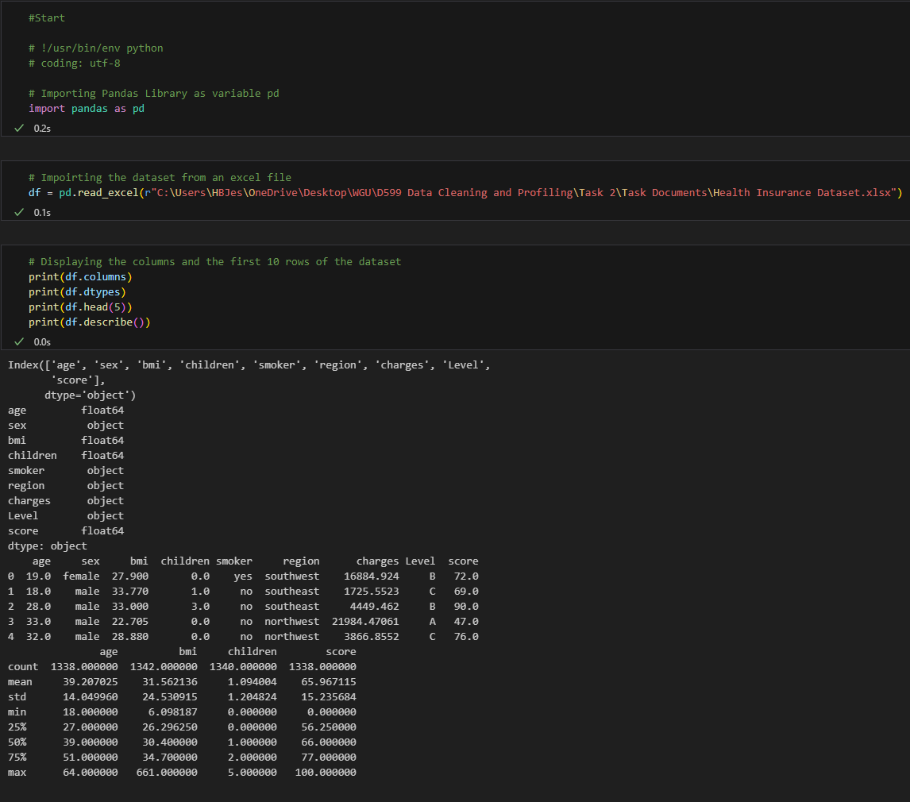
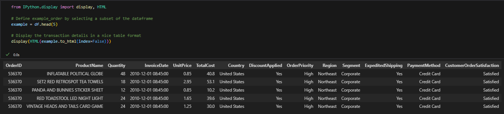

# Statistical Analysis and Market Basket

## Overview
This repo groups two analytics projects: statistical hypothesis testing on an insurance dataset and market basket analysis using transaction data. It is a good foundation repo for showing applied statistics and association rule mining.

## Coursework Context
This repository packages work originally completed as part of Western Governors University's (WGU) M.S. in Data Analytics program and reorganizes it into a public portfolio format. Screenshots extracted from the original written submissions are preserved in `assets/task2-report-extracts/` and `assets/task3-report-extracts/`.

## What It Shows
- exploratory data analysis
- statistical testing and interpretation
- transaction encoding for basket analysis
- association rule mining and business interpretation

## Included Files
- `notebooks/statistical_tests.ipynb`
- `notebooks/market_basket.ipynb`
- `data/Health Insurance Dataset.xlsx`
- `data/Megastore_Dataset_Task_3_3.csv`
- `requirements.txt`

## Results

- One-way ANOVA on BMI by region found a statistically significant regional difference with `F = 39.4069` and `p = 0.0000`.
- Mann-Whitney U testing for smoker status versus medical charges produced `p = 4.58e-129`, strongly supporting a meaningful cost difference between smokers and non-smokers.
- The market basket analysis surfaced top Apriori rules with support of `0.011338`, perfect confidence of `1.0`, and lift of `88.2`.
- The strongest retail rules linked themed children's gift items, making the repo a good example of translating association rules into bundling and cross-sell strategy.

## Selected Visuals

